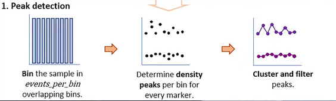

NOTE: *R version 4.5.0*. Also make sure [Rtools45](https://cran.r-project.org/bin/windows/Rtools/rtools45/rtools.html) is downloaded.

## STEP 0.1: DOWNLOAD PACKAGES (SKIP IF ALREADY DONE)

Navigate towards 'Tools \> Install Packages' and download the following packages:

1.  *ggplot2*
2.  *ggpubr*
3.  *pheatmap*
4.  *tidyr*
5.  *devtools*
6.  *dplyr*
7.  *glue*
8.  *FNN*
9.  *matrixStats*
10. *tibble*

Then go on to download *BioConductor* in the following way in order to download *FlowCore* correctly.

```{r}
if (!require("BiocManager", quietly = TRUE))
    install.packages("BiocManager")

#Initialize Bioc devel to download packages.
BiocManager::install(version='devel')

BiocManager::install("flowCore", force = TRUE)
BiocManager::install("flowAI")
BiocManager::install("ggcyto")
BiocManager::install("openCyto")

#Initialize devtools to download packages from github
devtools::install_github("saeyslab/PeacoQC", force=TRUE)
devtools::install_github("saeyslab/FlowSOM")
```

# PREPROCESSING

*Note: Preprocessing the full dataset can be CPU-intensive. It's better to process in batches and save `.fcs` files after each step to avoid data loss in case RStudio crashes.*

## STEP 1: STANDARDIZATION + COMPENSATION

The code below selects the patient files based on their patient_id from the .LMD files. The .LMD files contain two versions of .fcs files: Version 3.0 or Version 2.0. In this pipeline version 3.0 is selected as these contain the spillover matrices for compensation.

-   *fcs_summary.csv* is made in order to check if all the version 3 files have linear scale or LOG scale. This pipeline only works on linearly scaled data.

```{r}
library('flowCore') 
library('ggplot2')
library('flowAI')
library('readxl')
library('ggcyto')
library('openCyto')
library('flowClust')
library(glue)
library(dplyr)
library(tibble)
```

```{r}
#LOADING IN .LMD FILES
knitr::opts_chunk$set(cache = TRUE, warning = FALSE, 
                      message = FALSE, cache.lazy = FALSE)

# Select patient group
patient_group <- 'aml'
fcs_dir <- paste0("D:/Internship/data/1. full dataset/", patient_group)

if (!dir.exists(fcs_dir)) stop("Directory does not exist: ", fcs_dir)

fcs_files <- list.files(path = fcs_dir, pattern = "\\.LMD$", full.names = TRUE)

fcs_data_list <- list()
fcs_summary <- list()

#extracting data
for (file_path in fcs_files) {
  file_name <- basename(file_path)
  
  version3_loaded <- FALSE
  
  for (i in 1:2) {
    tryCatch({
      ff_try <- suppressWarnings(read.FCS(file_path, dataset = i))
      
      version_keys <- grep("version", names(ff_try@description), ignore.case = TRUE, value = TRUE)
      
      if (length(version_keys) > 0) {
        fcs_version <- ff_try@description[[version_keys[1]]]
        
        if (grepl("^3(\\.0)?$", fcs_version)) { #selecting version 3
          # Save version 3 dataset
          fcs_data_list[[file_name]] <- ff_try
          version3_loaded <- TRUE
        }
        
        # For summary table
        fcs_summary[[length(fcs_summary) + 1]] <- tibble(
          file_name = file_name,
          dataset = i,
          version = fcs_version,
          column_names = list(colnames(ff_try))
        )
      } else {
        warning(glue("No version found in {file_name} (dataset {i})"))
      }
      
      if (version3_loaded) break  # Exit loop if version 3 is found and saved
      
    }, error = function(e) {
      message(glue("Error reading {file_name} (dataset {i}): {e$message}"))
    })
  }
}

# Export summary
fcs_summary_df <- bind_rows(fcs_summary) %>%
  mutate(column_names = sapply(column_names, function(x) paste(x, collapse = ", ")))

#change filename to what you want
write.csv(fcs_summary_df, "D:/Internship/data/fcs_summary_aml.csv", row.names = FALSE)
```

### STEP 1.1: COLUMNNAME STANDARDIZATION

While reading the files, it was observed that column names were not consistent across files. They appeared in two different formats:

This format for all the files:

```         
[1] "FS-H"   "FS-A"   "SS-H"   "SS-A"   "FL1-A"  "FL2-A"  "FL3-A"  "FL4-A"  "FL5-A"  "FL6-A"  "FL7-A"  "FL8-A"  "FL9-A"  "FL10-A" "TIME" 
```

This format for all the tube 1 files:

```         
 [1] "FS INT LIN"   "SS INT LIN"   "FL1 INT LOG"  "FL2 INT LOG"  "FL3 INT LOG"  "FL4 INT LOG"  "FL5 INT LOG"  "FL6 INT LOG"  "FL7 INT LOG"  [10] "FL8 INT LOG"  "FL9 INT LOG"  "FL10 INT LOG" "TIME"         "FS PEAK LIN"  "SS PEAK LIN" 
```

This shows that some files are in log scale while others are linear; this must be standardized first.\
Column names have been unified for consistent access and to exclude unnecessary ones during preprocessing.

```{r}
#CHECKING COLUMN NAMES BEFORE NAME STANDARDIZATION
fs0 <- fcs_data_list[[2]]
colnames(fs0)
```

```{r}
#STANDARDIZING COLUMNNAMES
rename_common_channels <- function(ff) {
  standard_names <- c("FITC", "PE", "ECD", "PC5.5", "PC7", 
                      "APC", "A700", "A750", "HLA", "KO")
  
  old_names <- colnames(ff)
  new_names <- old_names
  
  #Rename fluoroscent channels
  for (i in seq_along(standard_names)) {
    pattern <- paste0("^FL", i, "([ -].*)?$")
    matched_idx <- grep(pattern, old_names, ignore.case = TRUE)
    
    if (length(matched_idx) > 0) {
      new_names[matched_idx[1]] <- standard_names[i]
    }
  }
  
  #Rename scatter channels
  scatter_renames <- list(
    "FS INT LIN"   = "FS-A",
    "FS PEAK LIN"  = "FS-H",
    "SS INT LIN"   = "SS-A",
    "SS PEAK LIN"  = "SS-H"
  )
  
  for (original in names(scatter_renames)) {
    idx <- which(old_names == original)
    if (length(idx) > 0) {
      new_names[idx] <- scatter_renames[[original]]
    }
  }

  colnames(ff@exprs) <- new_names
  colnames(ff) <- new_names
  
  return(ff)
}

renamed_fcs_list <- lapply(fcs_data_list, rename_common_channels)
```

```{r}
#CHECKING COLUMN NAMES AFTER STANDARDIZATION
fs1 <- renamed_fcs_list[[2]]
colnames(fs1)
```

### STEP 1.2: COMPENSATION

When using a FCS 2.0 version file, no manual compensation needs to be implemented. For the FCS 3.0 version, manual compensation can be performed by accessing the spillover matrix through `spillover(ff)` and perform compensation by `` compensate(ff, spillover(ff)$`$SPILLOVER`) ``. It is also possible to import the spillover matrix from an excel file and implement it using `compensate(ff, excel_matrix)`

*NOTE 1: make sure compensation matrix is in fractions and NOT percentages!!*

*NOTE 2: It may be that for certain fluorochromes both the area and the width of the signal are measured. In the spillover matrix, these two will have identical values, resulting in a singular matrix and making it unable to be inverted and used for compensation. The width columns of fluoroscent signal measurements were therefore removed before compensation.*

There can be cases where tubes other than Tube 1 do not contain a valid spillover matrix, a reference sample is then selected from which the spillover matrix is used. This ensures proper compensation when the original `.fsc` file lacks a correctly stored matrix.

-   For healthy patient 4 was used as reference.

-   For mds patient 103 was used as reference.

-   For aml patient 145 was used as reference.

*NOTE: TIMESTEP IS NOT PRESENT IN .fcs FILE. In [NAVIOS TETRA MANUAL](chrome-extension://efaidnbmnnnibpcajpcglclefindmkaj/https://4.imimg.com/data4/MJ/IL/MY-4372999/navios-flow-cytometer.pdf), the TIME parameter reflects the timing of each event as unitless integers representing time bins, rather than actual seconds. To convert these values into real-time units, TIMESTEP must be applied as scaling factor.*

*For Navios cytometer, TIME channel spans 1,048,576 bins (2²⁰) over a default acquisition period of 300 seconds. Therefore, each TIME unit corresponds to approximately 0.000286 seconds (300 ÷ 1,048,576). Multiplying TIME values by this TIMESTEP converts them into meaningful timestamps, enabling proper time-based quality control and analysis.*

```{r}
#CHECKING RAW DATA
ff_raw <- renamed_fcs_list[[2]]
df_raw <- as.data.frame(exprs(ff_raw))
```

```{r}
#COMPENSATION

#CHANGE REFERENCE LIST DEPENDING ON DISEASE STATE THAT IS PROCESSED
reference_spillovers <- list(
  "tube 2" = "Ki67-144 tube 2",
  "tube 3" = "Ki67-144 tube 3",
  "tube 4" = "Ki67-144 tube 4",
  "tube 5" = "Ki67-144 tube 5",
  "tube 6" = "Ki67-144 tube 6",
  "tube 7" = "Ki67-144 tube 7"
)

compensate_ff <- function(ff, filename = NULL, fcs_files = NULL, reference_spillovers = NULL) {
  #skip Tube 1
  if (grepl("tube 1", filename, ignore.case = TRUE)) {
    message("Skipping Tube 1: ", filename)
    keyword(ff)[["$TIMESTEP"]] <- 0.000286
    return(ff)
  }
  
  #selecting SSM, otherwise selecting reference SSM
  spill <- tryCatch(spillover(ff)[["$SPILLOVER"]], error = function(e) NULL)
  if (is.null(spill)) {
    tube_label <- sub(".*(tube \\d+).*", "\\1", filename, ignore.case = TRUE)
    tube_label <- trimws(tube_label)
    ref_name <- reference_spillovers[[tube_label]]

    
    if (!is.null(ref_name) && ref_name %in% names(fcs_files)) {
      ref_ff <- fcs_files[[ref_name]]
      spill <- tryCatch(spillover(ref_ff)[["$SPILLOVER"]], error = function(e) NULL)
      message("Using reference spillover from: ", ref_name, " for ", filename)
    }
    
    if (is.null(spill)) {
      warning("No spillover matrix found for: ", filename)
      keyword(ff)[["$TIMESTEP"]] <- 0.000286 #adding timestep to metadata
      return(ff)
    }
  }
  
  #selecting appropriate channels
  exclude_channels <- c("FS-A", "FS-H", "SS-A", "SS-H", "TIME", "FS TOF LIN", "SS TOF LIN","FL7 INT LIN", "FL7 TOF LIN")
  fluor_channels <- setdiff(colnames(ff), exclude_channels)
  
  colnames(spill) <- fluor_channels
  rownames(spill) <- fluor_channels
  spill_filtered <- spill[setdiff(fluor_channels, "FL7-W"), setdiff(fluor_channels, "FL7-W")]
  
  ff_comp <- compensate(ff, spill_filtered)
  keyword(ff_comp)[["$TIMESTEP"]] <- 0.000286 #adding timestep to metadata

  return(ff_comp)
}

fcs_compensated <- Map(function(ff, name) {
  compensate_ff(ff, filename = name, fcs_files = renamed_fcs_list, reference_spillovers = reference_spillovers)
}, renamed_fcs_list, names(renamed_fcs_list))
```

```{r}
#CHECKING COMPENSATED DATA
ff_comp <- fcs_compensated[[2]]
df_comp <- as.data.frame(exprs(ff_comp))
```

```{r}
#SAVING COMPENSATED .FCS FILES
output_dir <- normalizePath(
  file.path("D:/Internship/data/2. compensated dataset", patient_group),
  mustWork = FALSE
)
dir.create(output_dir, showWarnings = FALSE)

for (file_name in names(fcs_compensated)) {
  file_path <- file.path(output_dir, paste0(file_name, ".fcs"))
  write.FCS(fcs_compensated[[file_name]], filename = file_path)
}
```

### STEP 1.3 - PEACOQC QUALITY CHECK

#### STEP 1.3.1 - Removal of margin events

For each fluorescent channel, the events are removed whole real intensity exceeds the detector's sensitivity using `PeacoQC::RemoveMargins`.

```{r}
library('flowCore') 
library('ggplot2')
library('flowAI')
library('readxl')
library('ggcyto')
library('openCyto')
library('flowClust')
library('PeacoQC')
library('glue')
```

```{r}
#LOADING IN DATA
knitr::opts_chunk$set(cache = TRUE, warning = FALSE, 
                      message = FALSE, cache.lazy = FALSE)

patient_group <- "mds"  #healthy BM/mds/aml
fcs_dir <- file.path("D:/Internship/data/2. compensated dataset", patient_group)


fcs_file_names <- list.files(path = fcs_dir, pattern = "\\.fcs$", full.names = FALSE)

fcs_paths <- file.path(fcs_dir, fcs_file_names)

fcs_compensated <- setNames(
  lapply(fcs_paths, read.FCS, transformation = FALSE),
  fcs_file_names
)
```

```{r}
#EXTRACT ORIGINAL SIZE OF DATASETS FOR EDA
raw_data_event_counts <- sapply(fcs_compensated, nrow)

raw_data_event_counts_df <- data.frame(
  Sample = names(raw_data_event_counts),
  Events = raw_data_event_counts
)

write.csv(raw_data_event_counts_df, file = glue("D:/Internship/raw_event_count_{patient_group}.csv"), row.names = FALSE)
```

```{r}
#REMOVE MARGIN EVENTS

channels_of_interest <- c("FS-H", "FS-A", "SS-H", "SS-A", "FITC", "PE", "ECD", "PC5.5","PC7","APC","A700","A750","HLA","KO")

fcs_margins <- lapply(fcs_compensated, function(ff) {
  present_channels <- intersect(channels_of_interest, colnames(exprs(ff)))
  
  PeacoQC::RemoveMargins(ff, present_channels)
})
```

#### STEP 1.3.2 - Quality control

Quality control is essential to account for potential technical issues that may have occured during data acquisition. Examples include sudden signal spikes caused by clogs in the system, gradual signal changes at the start of a run due to instrument warm-up, or fluctuations in acquisition speed that introduce persistent signal shifts. These artifacts can affect a large portion of the data and compromise downstream analysis.

Manually identifying and removing these problematic events is not only time-consuming but also introduces subjectivity. To address this, the Peak Extraction and Cleaning Oriented Quality Control (PeacoQC) can be used. PeacoQC offers a robust, automated approach for detecting and removing low-quality events from `.fcs` files. It scales efficiently for large datasets and demonstrates a high median balanced accuracy compared to other automated quality control methods like flowAI, making it a reliable solution for high-throughput quality control in flow cytometry.

It makes use of the density peaks within your data.



Once these peaks (regions of low quality events) are isolated, PeacoQC applies a two-step filtering strategy to clean the data:

1.  **Isolation Tree**: This method works similarly to a decision tree. It attempts to isolate abnormal bins based on their peak values, effectively identifying regions with aberrant signal patterns. Isolation trees are particularly useful for detecting abrupt shifts or unusual patterns that affect multiple markers simultaneously. A key advantage is their ability to identify and remove non-consecutive regions of low-quality data (such as short clogging events separated by normal data) which many other methods fail to catch.
2.  **Median Absolute Mediation Distance**: For subtler issues that may not be detected by the isolation tree, PeacoQC uses a second layer of filtering based on Median Absolute Deviation (MAD). This approach smooths the peak values for each marker over time, then calculates how far each bin's smoothed value deviates from the overall median. If a bin deviates beyond a certain threshold (by default, 6 MADs), it is flagged as low quality. This is especially helpful for identifying problems that affect individual markers, such as gradual drifts or isolated channel instability.

PeacoQC then goes on to perform a few important quick checks:

-   It warns you when one of your markers shows consistently increasing or decreasing signal over time. This could indicate problem like contamination. PeacoQC does not remove all the data, it does alert you.

-   It also warns you when it removes more than 70% of your total data. This could be sign of really poor quality sample.

```{r}
for (i in seq_along(fcs_margins)) {
  ff_name <- names(fcs_margins)[i]
  ff_one <- fcs_margins[[i]]
  
  #select channels I want to clean
  present_channels <- colnames(exprs(ff_one))
  channels_to_use <- intersect(channels_of_interest, present_channels)
  missing <- setdiff(channels_of_interest, present_channels)
  if (length(missing) > 0) {
    warning(paste("In", ff_name, "missing channels:", paste(missing, collapse = ", ")))
  }

  message(paste("Running PeacoQC on:", ff_name, "using channels:", paste(channels_to_use, collapse = ", ")))

  peacoqc_res <- PeacoQC(
    ff = ff_one,
    channels = channels_to_use,
    determine_good_cells = "all",
    save_fcs = TRUE,
    plot = TRUE,
    output_directory = file.path("D:/Internship/data/3. cleaned dataset", patient_group)
  )
}
```

### STEP 1.4 - TRANSFORMATION

Compensation corrects for spectral overlap between fluorochromes but does not address the underlying distribution of flow cytometry data. Such data typically exhibits a positively skewed distribution, especially in fluorescent channels. To make the data more suitable for analysis and visualization, transformation methods are applied to achieve a more symmetric, near-normal distribution (e.g. logarithmic, biexponential (logicle), or arcsinh).

In this workflow, fluorescent channels undergo an arcsinh transformation, while scatter channels are transformed linearly. After these transformations, all channels are normalized using min–max scaling, following the approach described by Duetz et al. (2021).

```{r}
library('flowCore') 
library('ggplot2')
library('flowAI')
library('readxl')
library('ggcyto')
library('openCyto')
library('flowClust')
library('PeacoQC')
```

```{r}
knitr::opts_chunk$set(cache = TRUE, warning = FALSE, 
                      message = FALSE, cache.lazy = FALSE)

patient_group <- "mds"  #healthy BM/mds/aml
fcs_dir <- file.path("D:/Internship/data/3. cleaned dataset", patient_group)


fcs_file_names <- list.files(path = fcs_dir, pattern = "\\.fcs$", full.names = FALSE)
fcs_paths <- file.path(fcs_dir, fcs_file_names)

#named list
fcs_cleaned <- setNames(
  lapply(fcs_paths, read.FCS, transformation = FALSE),
  fcs_file_names
)
```

#### STEP 1.4.1 - Transformations

```{r}
#ARCSINH TRANSFORMATION
arcsinh_transform <- function(ff, cofactor = 150, exclude_channels = c("FS-A", "FS-H", "SS-A", "SS-H", "TIME")) {
  transform_channels <- setdiff(colnames(exprs(ff)), exclude_channels)
  
  arcsinh_tf <- transformList(
    transform_channels,
    arcsinhTransform(a = 0, b = 1 / cofactor, c = 0)
  )

  ff_transformed <- transform(ff, arcsinh_tf)
  
  return(ff_transformed)
}

fcs_transformed <- lapply(fcs_cleaned, arcsinh_transform, cofactor = 150)
```

For the linear transformation, a reference marker is needed. We used CD45 marker (fluorochrome KO in this study) as the reference.

```{r}
linear_transform <- function(flow_frame, reference_marker = "KO",
                                       scatter_channels = c("SS-A", "FS-A", "SS-H", "FS-H")) {
  expr <- exprs(flow_frame)

  #Checking if channels are present
  missing <- setdiff(c(reference_marker, scatter_channels), colnames(expr))
  if (length(missing) > 0) {
    warning(paste("Skipping file: missing channels:", paste(missing, collapse = ", ")))
    return(flow_frame)
  }

  #Applying linear transformation
  for (channel in scatter_channels) {
    q5_ref  <- quantile(expr[, reference_marker], 0.05, na.rm = TRUE)
    q95_ref <- quantile(expr[, reference_marker], 0.95, na.rm = TRUE)
    q5_sc   <- quantile(expr[, channel], 0.05, na.rm = TRUE)
    q95_sc  <- quantile(expr[, channel], 0.95, na.rm = TRUE)

    a <- (q95_ref - q5_ref) / (q95_sc - q5_sc)
    b <- q5_ref - a * q5_sc

    lin_trans <- transformList(channel, linearTransform(a = a, b = b))
    flow_frame <- transform(flow_frame, lin_trans)
  }

  return(flow_frame)
}

fcs_transform_lin <- lapply(fcs_transformed, linear_transform)

#Preserve original names
names(fcs_transform_lin) <- names(fcs_transformed)
```

#### STEP 1.4.2 - Min-Max Normalization

For the min-max normalization the 0.001 and 0.999 quantiles are chosen as this is more robust against outliers, avoiding accidental skewing of the data if a few extreme measurements would be included.

```{r}
#MIN-MAX NORMALIZATION
min_max_quantile_normalize <- function(ff, exclude_channels = c("TIME", 'Original_ID')) {
  expr <- exprs(ff)
  
  norm_channels <- setdiff(colnames(expr), exclude_channels)
  
  expr[, norm_channels] <- apply(expr[, norm_channels, drop = FALSE], 2, function(x) {
    (x - quantile(x, 0.001, na.rm = TRUE)) / 
      (quantile(x, 0.999, na.rm = TRUE) - quantile(x, 0.001, na.rm = TRUE))
  })
  
  flowCore::exprs(ff) <- expr
  return(ff)
}

fcs_norm <- vector("list", length(fcs_transformed))
names(fcs_norm) <- names(fcs_transformed)

for (i in seq_along(fcs_transformed)) {
  cat("Normalizing flowFrame", i, "of", length(fcs_transformed), "\n")
  fcs_norm[[i]] <- min_max_quantile_normalize(fcs_transformed[[i]])
}
```

```{r}
#EXTRACT SIZE OF DATASETS AFTER QUALITY CONTROL FOR EDA
QC_data_event_counts <- sapply(fcs_norm, nrow)

QC_data_event_counts_df <- data.frame(
  Sample = names(QC_data_event_counts),
  Events = QC_data_event_counts
)

#change name to right disease state
write.csv(QC_data_event_counts_df, file = "D:/Internship/afterQC_event_count_mds.csv", row.names = FALSE)
```

```{r}
#SAVING .FCS FILES AFTER TRANSFORMATION

output_dir <- normalizePath(
  file.path("D:/Internship/data/4. transformed dataset", patient_group),
  mustWork = FALSE
)
dir.create(output_dir, showWarnings = FALSE)

for (file_name in names(fcs_norm)) {
  file_path <- file.path(output_dir, paste0(file_name, ".fcs"))
  write.FCS(fcs_norm[[file_name]], filename = file_path)
}
```

## STEP 2: REMOVAL OF UNWANTED EVENTS

```{r}
library('flowCore') 
library('ggplot2')
library('flowAI')
library('readxl')
library('ggcyto')
library('openCyto')
library('flowClust')
library(dplyr)
```

```{r}
knitr::opts_chunk$set(cache = TRUE, warning = FALSE, 
                      message = FALSE, cache.lazy = FALSE)

patient_group <- "mds"  #healthy BM/mds/aml
fcs_dir <- file.path("D:/Internship/data/4. transformed dataset", patient_group)


fcs_file_names <- list.files(path = fcs_dir, pattern = "\\.fcs$", full.names = FALSE)
fcs_paths <- file.path(fcs_dir, fcs_file_names)

#named list
fcs_transformed <- setNames(
  lapply(fcs_paths, read.FCS, transformation = FALSE),
  fcs_file_names
)
```

### STEP 2.1 - BEFORE GATING VISUALIZATION

The plots we want to save for inspection are:

1.  FSC-A vs. SSC-A
2.  FSC-A vs. FSC-H
3.  CD45 vs. SSC-A

```{r}
output_dir <- normalizePath(
  file.path("D:/Internship/data/5. preprocessed dataset", patient_group, "/before_gating/FSC-AvsFSC-H"),
  mustWork = FALSE
)
dir.create(output_dir, showWarnings = FALSE)

for (name in names(fcs_transformed)) {
  raw_ff <- fcs_transformed[[name]]
  base_name <- tools::file_path_sans_ext(name)
  
  p <- ggcyto(raw_ff, aes(x = `FS-A`, y = `FS-H`)) +
    geom_hex(bins = 128) +
    labs(
      title = paste("FSC-A vs FSC-H - (before gating):", base_name),
      x = "FSC-A", y = "FSC-H"
    ) +
    theme_minimal() +
    scale_fill_viridis_c(option = "C", direction = -1)
  
  ggsave(
    filename = file.path(output_dir, paste0(base_name, "_FSC-A_vs_FSC-H.png")),
    plot = p,
    width = 5, height = 5, dpi = 300
  )
}
```

### STEP 2.2 - GATING OUT DEBRIS

A custom gating strategy is employed in order to gate out debris. It is constructed of two distinct steps:

1.  *Debris removal*: Here, the function `flowClust.2d` is employed. It performs automated gating by applying model-based clustering on FS-A and SS-A channels. It uses the `flowClust` algorithm, which fits a mixture of multivariate t-distributions to the selected channels, modeling the data as a combination of distinct cell populations (clusters).

    In this code, the algorithm is used to identify 2 clusters in the lower left quantile as debris is often found in this region. The cluster with the highest density is selected and `clust2Poly` function is used to obtain a polygon gate.

2.  *Fat artifacts removal*: A triangular gate is applied to the upper left corner, where these artifacts often appear. This gate is defined as A triangular gate was defined for this purpose, with vertices at (0,0), (0, $max_{SSC-A}$), and (7/16 \* $max_{FCS}$ , $max_{SSC-A}$)

```{r}
# Helper function to identify max value
round_down_to_1_followed_by_zeros <- function(x) {
  if (x <= 0) return(1)
  10^floor(log10(x))
}

fcs_gated <- vector("list", length(fcs_transformed))

#GATING STRATEGY
for (i in seq_along(fcs_transformed)) {
  cat("Processing sample", i, "of", length(fcs_transformed), "\n")
  
  ff <- fcs_transformed[[i]]
  expr <- exprs(ff)[, c("FS-A", "SS-A")]

  max_fs <- max(expr[, "FS-A"], na.rm = TRUE)
  max_ss <- max(expr[, "SS-A"], na.rm = TRUE)
  
  max_fs_rounded <- round_down_to_1_followed_by_zeros(max_fs)
  max_ss_rounded <- round_down_to_1_followed_by_zeros(max_ss)
  
  #gating out debris
  debris_gate_limits <- list(
    "FS-A" = c(0, (max_fs_rounded / 4)),
    "SS-A" = c(0, (max_ss_rounded / 4))
  )
  
  ff_rect <- Subset(ff, rectangleGate(filterId = "DebrisRect", .gate = debris_gate_limits))
  
  fs <- flowSet(list(sample1 = ff_rect))
  
  debris_gate <- fsApply(fs, function(fr) {
    openCyto:::.flowClust.2d(
      fr,
      channels = c("FS-A", "SS-A"),
      K = 2,
      target = c(25000, 25000),
      filterId = "flowClustDebris"
    )
  })
  
  
  ff_clean <- Subset(ff, !debris_gate[[1]])
  
  #gating out fat artifacts
  triangle_coords <- matrix(
    c(
      0, max_ss,                            #top left
      ((max_fs / 16) * 7), max_ss,          #top right
      0, 0                                  #bottom corner
    ),
    ncol = 2,
    byrow = TRUE,
    dimnames = list(NULL, c("FS-A", "SS-A"))
  )
  
  triangle_gate <- polygonGate(filterId = "TriangleGate", .gate = triangle_coords)
  
  ff_clean <- Subset(ff_clean, !triangle_gate)

  #Final strict debris exclusion using rectangle when FlowClust fails
  debris_box_gate <- rectangleGate(
  filterId = "DebrisLowerLeftBox",
  "FS-A" = c(-Inf, (max_fs_rounded / 8)),
  "SS-A" = c(-Inf, (max_ss_rounded / 8))
)
  ff_clean <- Subset(ff_clean, !debris_box_gate)

  fcs_gated[[i]] <- ff_clean
}
```

```{r}
#EXTRACT SIZE OF DATASETS AFTER REMOVING DEBRIS FOR EDA
names(fcs_gated) <- basename(fcs_file_names)

gated_data_event_counts <- sapply(fcs_gated, nrow)
gated_data_event_counts_df <- data.frame(
  Sample = names(gated_data_event_counts),
  Events = gated_data_event_counts
)

#change name to right disease state
write.csv(gated_data_event_counts_df, file = "D:/Internship/gated_event_count_mds.csv", row.names = FALSE)
```

### STEP 2.3 - DOUBLET REMOVAL

We can use a developed R code section from the Duetz et al. (2021) paper to remove doublets from the data. This was manually adapted by:

1.  Adding an upper limit
2.  Changing the cutoff to 1 sd instead of 2 sd for the lower limit.

```{r}
is_single <- function(ff, plot = FALSE, ...) {
  fsc_a <- flowCore::exprs(ff)[,"FS-A"]
  fsc_h <- flowCore::exprs(ff)[,"FS-H"]
  
  bins <- cut(fsc_a, 10)
  
  ratios <- fsc_h / fsc_a
  slope_per_bin <- tapply(ratios, bins, mean)
  expected_values <- fsc_a * slope_per_bin[bins]
  deviations <- abs(fsc_h - expected_values)
  
  x <- tapply(fsc_a, bins, mean)
  e <- tapply(expected_values, bins, mean)
  d_lower <- tapply(deviations, bins, function(x){mean(x) + 1*sd(x)})
  d_upper <- tapply(deviations, bins, function(x){mean(x) + 2*sd(x)})
  
  lower_y <- e - d_lower
  upper_y <- e + d_upper
  
  lower_spl <- splinefun(x, lower_y)
  upper_spl <- splinefun(x, upper_y)
  
  selection <- fsc_h > lower_spl(fsc_a) & fsc_h < upper_spl(fsc_a)
  return(selection)
}

single_cells_list <- vector("list", length(fcs_gated))
names(single_cells_list) <- names(fcs_gated)

for (i in seq_along(fcs_gated)) {
  cat(sprintf("Processing sample %d of %d: %s\n", i, length(fcs_gated), names(fcs_gated)[i]))
  single_cells_list[[i]] <- is_single(fcs_gated[[i]], plot = FALSE)
}

fcs_singles <- mapply(function(ff, sel) {
  ff[sel, ]  # keep rows where sel == TRUE
}, fcs_gated, single_cells_list, SIMPLIFY = FALSE)
```

```{r}
#EXTRACT SIZE OF DATASETS AFTER DOUBLET REMOVAL FOR EDA

single_data_event_counts <- sapply(fcs_singles, nrow)
single_data_event_counts_df <- data.frame(
  Sample = names(single_data_event_counts),
  Events = single_data_event_counts
)

#change name to right disease state
write.csv(single_data_event_counts_df, file = "D:/Internship/preprocessed_event_count_mds.csv", row.names = FALSE)
```

### STEP 2.4 - AFTER GATING VISUALIZATION

The plots we want to save for inspection are:

1.  FSC-A vs. SSC-A
2.  FSC-A vs. FSC-H
3.  CD45 vs. SSC-A

```{r}
output_dir <- normalizePath(
  file.path("D:/Internship/data/5. preprocessed dataset", patient_group, "/after_gating/CD45vsSSC-A"),
  mustWork = FALSE
)
dir.create(output_dir, showWarnings = FALSE)

for (name in names(fcs_singles)) {
  raw_ff <- fcs_singles[[name]]
  base_name <- tools::file_path_sans_ext(name)
  
  p <- ggcyto(raw_ff, aes(x = `KO`, y = `SS-A`)) +
    geom_hex(bins = 128) +
    labs(
      title = paste("CD45 vs SSC-A - (after gating):", base_name),
      x = "CD45", y = "SSC-A"
    ) +
    theme_minimal() +
    scale_fill_viridis_c(option = "C", direction = -1)
  
  ggsave(
    filename = file.path(output_dir, paste0(base_name, "_CD45_vs_SSC-A.png")),
    plot = p,
    width = 5, height = 5, dpi = 300
  )
}
```

### STEP 2.5 - CHANGING COLNAMES TO MARKERNAMES

Here we change the names of the fluorescent channels to the markers that they actually represent.

```{r}
#MANUALLY ADD NAMES OF WHAT EACH CHANNEL REPRESENTS PER TUBE
tube_markers <- list(
  c("FSC-A", "SSC-A", "IgG1-1", "NA1", "IgG1-2", "CD13", "CD117", "CD34", "NA2", "NA3", "HLA-DR", "CD45", "TIME", "FSC-H"), #Tube 1
  c("FSC-H", "FSC-A", "SSC-A", "Ki-67", "CD14", "CD64", "CD13", "CD117", "CD34", "CD10", "CD11b", "HLA-DR", "CD45", "TIME"), #Tube 2
  c("FSC-H", "FSC-A", "SSC-A", "Ki-67", "CD105", "CD123", "CD33", "CD117", "NA1", "CD71", "CD235a", "HLA-DR", "CD45", "TIME"), #Tube 3
  c("FSC-H", "FSC-A", "SSC-A", "Ki-67", "NA1", "NA2", "CD33", "CD117", "CD36", "NA4", "NA5", "HLA-DR", "CD45", "TIME"), #Tube 4
  c("FSC-H", "FSC-A", "SSC-A", "CD16", "CD64", "Bcl-2", "CD13", "CD117", "CD34", "CD10", "CD14", "HLA-DR", "CD45", "TIME"), #Tube 5
  c("FSC-H", "FSC-A", "SSC-A", "NA1", "CD105", "Bcl-2", "CD33", "CD117", "NA2", "CD71", "CD235a", "HLA-DR", "CD45", "TIME"), #Tube 6
  c("FSC-H", "FSC-A", "SSC-A", "NA1", "NA2", "Bcl-2", "CD33", "CD117", "CD36", "NA3", "NA4", "HLA-DR", "CD45", "TIME") #Tube 7
)

#Helper function that extracts Tube number from filename
getTubeNumber <- function(name) {
  tube_num <- regmatches(name, regexpr("tube[ _]?\\d+", name, ignore.case = TRUE))
  if(length(tube_num) == 0) return(NA)
  as.numeric(gsub(".*?(\\d+)", "\\1", tube_num, ignore.case = TRUE))
}

#which columns do you want to extract from the datasets?
cols_to_keep <- c("FS-A", "SS-A", "FITC", "PE", "ECD", "PC5.5", "PC7", "APC", "A700", "A750", "HLA", "KO", "TIME", "FS-H")


#Changing channel names
for (fcs_name in names(fcs_singles)) {
  tube_num <- getTubeNumber(fcs_name)
  
  if (is.na(tube_num) || tube_num < 1 || tube_num > length(tube_markers)) {
    warning(paste("Tube number not found or invalid in name:", fcs_name))
    next
  }
  
  fcs_obj <- fcs_singles[[fcs_name]]
  
  cols_present <- colnames(fcs_obj@exprs)
  cols_keep_present <- intersect(cols_present, cols_to_keep)
  
  if (length(cols_keep_present) > 0) {
    exprs_mat <- fcs_obj@exprs[, cols_keep_present, drop = FALSE]
    
    fcs_obj <- flowCore::flowFrame(exprs_mat)
  } else {
    warning(paste("No matching columns to keep in", fcs_name))
    next
  }
  
  ncols <- ncol(fcs_obj@exprs)
  nmarkers <- length(tube_markers[[tube_num]])
  
  if (ncols != nmarkers) {
    warning(paste("After cleaning, column number mismatch in", fcs_name, 
                  "- has", ncols, "columns but", nmarkers, "markers provided"))
    next
  }
  
  # Assign new column names
  new_names <- tube_markers[[tube_num]]
  colnames(fcs_obj@exprs) <- new_names
  colnames(fcs_obj) <- new_names  # Updates metadata

  fcs_singles[[fcs_name]] <- fcs_obj
  
  message(paste("Processed and renamed columns for", fcs_name))
}

```

```{r}
#CHECKING FOR ONE FILE IF RENAMING WAS SUCCESSFULL
ff_vb <- fcs_singles[[3]]
colnames(ff_vb)
```

### STEP 2.6 - SAVING PREPROCESSED FILES

```{r}
#SAVING PREPROCESSED FILES
output_dir <- normalizePath(
  file.path("D:/Internship/data/5. preprocessed dataset", patient_group),
  mustWork = FALSE
)
dir.create(output_dir, showWarnings = FALSE)

for (file_name in names(fcs_singles)) {
  file_path <- file.path(output_dir, file_name)
  write.FCS(fcs_singles[[file_name]], filename = file_path)
}
```

## STEP 3: MERGING OF TUBES

```{r}
library('flowCore') 
library('ggplot2')
library('flowAI')
library('readxl')
library('ggcyto')
library('openCyto')
library('flowClust')
library(dplyr)
library(FNN)
library(matrixStats)
```

```{r}
knitr::opts_chunk$set(cache = TRUE, warning = FALSE, 
                      message = FALSE, cache.lazy = FALSE)

patient_group <- "mds"  #healthy BM/mds/aml
fcs_dir <- file.path("D:/Internship/data/5. preprocessed dataset", patient_group)


fcs_file_names <- list.files(path = fcs_dir, pattern = "\\.fcs$", full.names = FALSE)
fcs_paths <- file.path(fcs_dir, fcs_file_names)

fcs_preproc <- setNames(
  lapply(fcs_paths, read.FCS, transformation = FALSE),
  fcs_file_names
)

#GROUP THE TUBES PER PATIENT
get_patient_id <- function(fname) {
  pat <- regexpr("tube", fname, ignore.case = TRUE)
  if (pat == -1) {
    return(tools::file_path_sans_ext(fname))
  }
  patient_id <- substr(fname, 1, pat - 2)
  trimws(patient_id)
}

patient_ids <- sapply(names(fcs_preproc), get_patient_id)

fcs_by_patient <- split(fcs_preproc, patient_ids)

#determine output folder for merged files
output_dir <- file.path("D:/Internship/data/6. merged dataset", patient_group)
dir.create(output_dir, recursive = TRUE, showWarnings = FALSE)
```

The FlowSOM algorithm is designed to operate on a single `.fcs` file. In order to retrieve a MST that contains erythropoiesis, myelopoiesis and monopoiesis, imputation across multiple tubes is required. Specifically, tubes 2, 3, and 4 were combined to display a MST for Ki-67 expression, while tubes 5, 6, and 7 were used to build a MST for Bcl-2 expression analysis.

In previous work, Mestrum et al. (2023) utilized the Infinicyt software for tube merging. Infinicyt applies k-nearest neighbors (kNN) imputation using a single neighbor (k = 1). However, evaluations of merging and imputation quality in flow cytometry data revealed significant limitations in this approach according to Mocking et al. (2023). It was seen that R packages such as CyTOFmerge and CytoBackBone outperformed Infinicyt.

In this code the `CombineFCS` function of the `CyTOFmerge` package is used to serial merge the panels together. This function uses the same k-NN algorithm however this time with k = 50. For each cell, the values of non-shared markers are imputed by calculating the median expression from its 50 nearest neighbors, ensuring biologically plausible estimates.

*Note: This imputation step is computationally intensive. While the use of the MatrixStats package has improved performance, the process remains time-consuming—merging three tubes per patient currently takes approximately 12 minutes.*

```{r}
CombineFCS <- function(FCS1, RelevantMarkers1, FCS2, RelevantMarkers2, backbone_markers) {

  if (is.character(RelevantMarkers1)) {
    RelevantMarkers1 <- match(RelevantMarkers1, colnames(FCS1@exprs))
  }
  if (is.character(RelevantMarkers2)) {
    RelevantMarkers2 <- match(RelevantMarkers2, colnames(FCS2@exprs))
  }

  FCS1.data <- as.data.frame(FCS1@exprs[, RelevantMarkers1, drop = FALSE])
  FCS2.data <- as.data.frame(FCS2@exprs[, RelevantMarkers2, drop = FALSE])
  VarNames1 <- colnames(FCS1.data)
  VarNames2 <- colnames(FCS2.data)

  #Identify shared and non-shared markers
  shared_markers <- intersect(VarNames1, VarNames2)
  overlapping_non_backbone <- setdiff(shared_markers, backbone_markers)

  #Ensure backbone markers are present
  backbone <- intersect(backbone_markers, shared_markers)
  if (length(backbone) == 0) {
    stop("No shared backbone markers found in both FCS files.")
  }

  #Backbone-based data for kNN
  FCS1.match <- FCS1.data[, backbone, drop = FALSE]
  FCS2.match <- FCS2.data[, backbone, drop = FALSE]

  #Non-overlapping markers
  FCS1.nonshared <- setdiff(VarNames1, shared_markers)
  FCS2.nonshared <- setdiff(VarNames2, shared_markers)

  #Special case: FCS2 has no new markers (no imputation into FCS1)
  if (length(FCS2.nonshared) == 0) {
    ImputeFromFCS1 <- NULL

    # Only need to impute into FCS2 if FCS1 has extra markers
    if (length(FCS1.nonshared) > 0) {
      IDX2 <- get.knnx(FCS1.match, FCS2.match, k = 50)$nn.index
      ImputeFromFCS1 <- sapply(FCS1.nonshared, function(marker) {
        values <- FCS1.data[, marker]
        rowMedians(matrix(values[IDX2], nrow = nrow(IDX2)))
      })
      if (is.vector(ImputeFromFCS1)) {
        ImputeFromFCS1 <- matrix(ImputeFromFCS1, ncol = 1)
        colnames(ImputeFromFCS1) <- FCS1.nonshared
      }
    } else {
      ImputeFromFCS1 <- matrix(nrow = nrow(FCS2.match), ncol = 0)
    }

    #Combine
    Data.combine.1 <- cbind(
      FCS1.match,
      if (length(FCS1.nonshared) > 0) FCS1.data[, FCS1.nonshared, drop = FALSE],
      if (length(overlapping_non_backbone) > 0) FCS1.data[, overlapping_non_backbone, drop = FALSE]
    )

    Data.combine.2 <- cbind(
      FCS2.match,
      if (ncol(ImputeFromFCS1) > 0) ImputeFromFCS1,
      if (length(overlapping_non_backbone) > 0) FCS2.data[, overlapping_non_backbone, drop = FALSE]
    )

    colnames(Data.combine.2) <- colnames(Data.combine.1)
    return(as.data.frame(rbind(Data.combine.1, Data.combine.2)))
  }

  #General case: imputation in both directions
  IDX1 <- get.knnx(FCS2.match, FCS1.match, k = 50)$nn.index
  IDX2 <- get.knnx(FCS1.match, FCS2.match, k = 50)$nn.index

  ImputeFromFCS2 <- NULL
  if (length(FCS2.nonshared) > 0) {
    ImputeFromFCS2 <- sapply(FCS2.nonshared, function(marker) {
      values <- FCS2.data[, marker]
      rowMedians(matrix(values[IDX1], nrow = nrow(IDX1)))
    })
    if (is.vector(ImputeFromFCS2)) {
      ImputeFromFCS2 <- matrix(ImputeFromFCS2, ncol = 1)
      colnames(ImputeFromFCS2) <- FCS2.nonshared
    }
  }

  ImputeFromFCS1 <- NULL
  if (length(FCS1.nonshared) > 0) {
    ImputeFromFCS1 <- sapply(FCS1.nonshared, function(marker) {
      values <- FCS1.data[, marker]
      rowMedians(matrix(values[IDX2], nrow = nrow(IDX2)))
    })
    if (is.vector(ImputeFromFCS1)) {
      ImputeFromFCS1 <- matrix(ImputeFromFCS1, ncol = 1)
      colnames(ImputeFromFCS1) <- FCS1.nonshared
    }
  }

  if (is.null(ImputeFromFCS2)) {
    ImputeFromFCS2 <- matrix(nrow = nrow(FCS1.match), ncol = 0)
  }
  if (is.null(ImputeFromFCS1)) {
    ImputeFromFCS1 <- matrix(nrow = nrow(FCS2.match), ncol = 0)
  }

  Data.combine.1 <- cbind(
    FCS1.match,
    if (length(FCS1.nonshared) > 0) FCS1.data[, FCS1.nonshared, drop = FALSE],
    if (ncol(ImputeFromFCS2) > 0) ImputeFromFCS2,
    if (length(overlapping_non_backbone) > 0) FCS1.data[, overlapping_non_backbone, drop = FALSE]
  )

  Data.combine.2 <- cbind(
    FCS2.match,
    if (ncol(ImputeFromFCS1) > 0) ImputeFromFCS1,
    if (length(FCS2.nonshared) > 0) FCS2.data[, FCS2.nonshared, drop = FALSE],
    if (length(overlapping_non_backbone) > 0) FCS2.data[, overlapping_non_backbone, drop = FALSE]
  )

  colnames(Data.combine.2) <- colnames(Data.combine.1)
  Data.combine <- rbind(Data.combine.1, Data.combine.2)

  return(as.data.frame(Data.combine))
}
```

```{r}
#one patient merging
fcs_patient <- fcs_by_patient[[]]
```

```{r}
#MERGING OF FILES

#Manually select which channels to use for merging
marker_list <- list(
  c("FSC-A", "SSC-A", "IgG1-1", "IgG1-2", "CD13", "CD117", "CD34", "HLA-DR", "CD45","FSC-H"),  #Tube 1
  c("FSC-H", "FSC-A", "SSC-A", "Ki-67", "CD14", "CD64", "CD13", "CD117", "CD34", "CD10", "CD11b", "HLA-DR", "CD45"),  #Tube 2
  c("FSC-H", "FSC-A", "SSC-A", "Ki-67", "CD105", "CD123", "CD33", "CD117", "CD71", "CD235a", "HLA-DR", "CD45"), #Tube 3
  c("FSC-H", "FSC-A", "SSC-A","Ki-67","CD33", "CD117", "CD36","HLA-DR", "CD45"), #Tube 4
    c("FSC-H", "FSC-A", "SSC-A", "CD16", "CD64", "Bcl-2", "CD13", "CD117", "CD34", "CD10", "CD14", "HLA-DR", "CD45"), #Tube 5
  c("FSC-H", "FSC-A", "SSC-A", "CD105", "Bcl-2", "CD33", "CD117", "CD71", "CD235a", "HLA-DR", "CD45"), #Tube 6
  c("FSC-H", "FSC-A", "SSC-A", "Bcl-2", "CD33", "CD117", "CD36","HLA-DR", "CD45") #Tube 7
) 


MultiCombineFCS <- function(file_list, marker_list, backbone_markers) {
  fcs1 <- file_list[[1]]
  fcs2 <- file_list[[2]]
  combined <- CombineFCS(fcs1, marker_list[[1]], fcs2, marker_list[[2]], backbone_markers)

  if (length(file_list) > 2) {
    for (i in 3:length(file_list)) {
      message(paste("Merging tube", i, "into combined dataset..."))

      # Convert combined matrix back to flowFrame
      temp_frame <- flowCore::flowFrame(as.matrix(combined))

      fcs_next <- file_list[[i]]
      next_markers <- marker_list[[i]]

      combined <- CombineFCS(temp_frame, colnames(temp_frame@exprs), fcs_next, next_markers, backbone_markers)
    }
  }

  return(combined)
}

backbone_markers <- c("CD45", "HLA-DR", "CD117")  # Define once for reuse

for (patient in names(fcs_by_patient)) {
  cat("Processing patient:", patient, "\n")
  
  patient_files <- fcs_by_patient[[patient]]
  
  if (length(patient_files) < 2) {
    warning("Not enough tubes to merge for patient: ", patient)
    next
  }

  # Select which tubes to merge by changing indices
  selected_files <- patient_files[c(2,3,4,6,7)]
  selected_markers <- marker_list[c(2,3,4,6,7)]

  # Merge
  merged_data <- MultiCombineFCS(selected_files, selected_markers, backbone_markers)

  # Optional: add patient ID or origin label if needed
  # merged_data$Patient <- patient

  # Save to FCS
  merged_flowframe <- flowCore::flowFrame(as.matrix(merged_data))
  output_path <- file.path(output_dir, paste0(patient, "_merged.fcs"))
  flowCore::write.FCS(merged_flowframe, filename = output_path)

  cat("Saved merged data for patient:", patient, "\n")
}
```

## STEP 4: AGGREGATE FILES

We aggregate patient files in order to get one `.fcs` file representing the whole disease group. This aggregation step is necessary, as the FlowSOM algorithm requires a single .fcs file as input for training and clustering.

Deutz et al. (2021) opted for a method that selected 40.000 cells per `.fcs`, however this does not account for differences in `.fcs` sizes. So what we did here is calculate how many events we want in the final aggregated file and based on that calculation we use the function `AggregateFlowFrames` to select the events from all the patients. This gives the most robust results.

-   for Healthy group: 40.000 x 50 = 2.000.000

-   for MDS patients: 40.000 x 20 = 800.000

-   for AML patients: 40.000 x 18 = 720.000

```{r}
library('flowCore') 
library('ggplot2')
library('flowAI')
library('readxl')
library('ggcyto')
library('openCyto')
library('flowClust')
library(dplyr)
```

```{r}
knitr::opts_chunk$set(cache = TRUE, warning = FALSE, 
                      message = FALSE, cache.lazy = FALSE)

patient_group <- "healthy BM"  #healthy BM/mds/aml

fcs_dir <- file.path("D:/Internship/data/6. merged dataset", patient_group)
output_dir <- normalizePath(
  file.path("D:/Internship/data/7. aggregated files", patient_group),
  mustWork = FALSE
)
dir.create(output_dir, showWarnings = FALSE)

all_fcs_files <- list.files(path = fcs_dir, pattern = "\\.fcs$", full.names = FALSE)
fcs_paths <- file.path(fcs_dir, all_fcs_files)

#set parameters
set.seed(2020)
aggregate_cells <- 2000000
```

```{r}
#AGGREGATING
agg <- FlowSOM::AggregateFlowFrames(
  fileNames = fcs_paths,
  cTotal = aggregate_cells,
  writeOutput = TRUE,
  outputFile = file.path(output_dir, "all_tubes_aggregated_everything.fcs")
)
```

# FLOWSOM

## LOADING IN DATA + LIBRARIES

```{r}
library('flowCore') 
library('ggplot2')
library('flowAI')
library('readxl')
library('ggcyto')
library('openCyto')
library('flowClust')
library(dplyr)
```

```{r}
patient_group <- 'aml' #healthy BM/mds/aml
dir_results <- file.path("D:/Internship/FlowSOM results", patient_group)
dir.create(dir_results, showWarnings = FALSE)


# Path to merged dataset file
fcs_path <- file.path("D:/Internship/data/7. aggregated files", patient_group, "all_tubes_aggregated_everything.fcs")

# Read FCS file
ff <- flowCore::read.FCS(fcs_path, transformation = FALSE)

colnames(ff)
```

```{r}
#parameters are here chosen by https://www.youtube.com/watch?v=hP1aTZ1Iqfcthe 10x10 grid most used for smaller panels. 12x12, 15x15 or 20x20 often chosen for larger panels. for metaclusters, recommendation is to choose 1.5 times the amount of clusters you are expecting. Use the scatterplots to finetune. The algorithms to choose the amount of clustering within flowSOM are not recommended as they strongly underestimate the amount of clusters. 
SOM_x <- 15 
SOM_y <- 15 
n_meta <- 20 
seed <- 2020 
scaling <- FALSE

expr_matrix <- exprs(ff)

excluded_markers <- c("File", "File_scattered", "Original_ID", "FSC-H")
selected_markers <- setdiff(colnames(expr_matrix), excluded_markers)
selected_exprs <- expr_matrix[, selected_markers]
ff_selected <- flowFrame(selected_exprs)
```

## RUNNING FLOWSOM

You start of with building a tree based on the lineage markers within your panel. This is done to distinguish cell populations within your dataset.

### TRAINING Cell population Tree

```{r}
library(FlowSOM)
fsom <- FlowSOM(input = ff_selected, scale = scaling, 
                seed = seed, 
                nClus = n_meta, 
                xdim = SOM_x, 
                ydim = SOM_y)
```

```{r}
#saving trained tree
saveRDS(fsom, file = file.path(dir_results, "fsom_12X12meta20_healthyBM.rds"))
```

Create a report summarizing the FlowSOM results, including cluster information and visualizations. The `FlowSOMmary` function generates a comprehensive report that can be saved as a PDF file.

```{r}
FlowSOMmary(fsom, plotFile = paste0(dir_results, "fsom_summary_12x12meta20_healthyBM.pdf"))
```

### Extracting established Tree from .RDS file

```{r}
library('flowCore') 
library('ggplot2')
library('flowAI')
library('readxl')
library('ggcyto')
library('openCyto')
library('flowClust')
library(dplyr)
```

```{r}
library(FlowSOM)
fsom <- readRDS("D:/Internship/FlowSOM results/aml/fsom_15X15meta20_aml.rds")
```

## MANUAL LABELING

In order to establish which metaclusters represent which types of cells, it is usefull to look at 2D scatterplots.

-   `channel_pairs` = which scatterplots do we want to create

-   `metaclusters_of_interest` = which metaclusters do we want to create the scatterplots of? If equal to seq_len(n_meta) for all metaclusters scatterplots are made

-   `clusters_of_interest` = if you want to visualize one node. `metaclusters_of_interest` should in this case be 0.

```{r}
#SCATTERPLOTS
channel_pairs <- list(
  c("CD45", "SSC-A"),
  c("CD13", "SSC-A"),
  c("HLA-DR", "CD117")
) 

#which metacluster/node
metaclusters_of_interest <- c(16) #seq_len(n_meta)
node_of_interest <- NULL

Plot2DScatters(fsom = fsom, channelpairs = channel_pairs, metaclusters = metaclusters_of_interest, clusters = node_of_interest, plotFile = paste0(dir_results, "fsom_2D_lymph_scatterplot_metacluster.png"), centers = FALSE, density=FALSE)
```

Once you define which metaclusters represent which celltypes, you can add the manual labels to the flowSOM object and visualize.

```{r}
#Define labels and associated metacluster IDs
metacluster_groups <- list(
  "Mature Erythroids"     = c(5),
  "Immature Erythroids"   = c(),
  "Mature Myeloids"       = c(2,3,6),
  "Immature Myeloids"     = c(1,8,9,18),
  "Platelets"             = c(),
  "Blasts"                = c(13,14,15,4),
  "CD36-/CD71+ cells"     = c(),
  "Eosinophils"           = c(17),
  "Debris"                = c(7,19),
  "Mature Monocytes"      = c(10,11,12),
  "Lymphocytes"           = c(16),
  "Other"                 = c(20)
)

#define color scheme for best visualisation
celltype_colors <- c(
  "Mature Erythroids"     = "#e41a1c",  #red
  "Immature Erythroids"   = "#ff7f00",  #orange
  "Mature Myeloids"       = "#984ea3",  #purple
  "Immature Myeloids"     = "#f20a90",  #bright pink
  "Platelets"             = "#ffff33",  #yellow
  "Blasts"                = "#4daf4a",  #green
  "CD36-/CD71+ cells"     = "#f781bf",  #light pink
  "Eosinophils"           = "#377eb8",  #light grey
  "Debris"                = "#000000",  #black
  "Mature Monocytes"      = "#253bfc",  #bright blue
  "Lymphocytes"           = "#23f8d6",  #teal
  "Other"                 = "#bcbcbc"   #grey
)


#Assign labels based on your grouping
metacluster_annotation <- rep("Unlabeled", n_meta)
for (label in names(metacluster_groups)) {
  ids <- metacluster_groups[[label]]
  metacluster_annotation[ids] <- label
}

#Add metacluster labels to FlowSOM object and save
fsom$metaclustering_labels <- metacluster_annotation[fsom$metaclustering]
saveRDS(fsom, file = file.path(dir_results, "fsom_15X15meta20_aml.rds"))
```

```{r}
#visualise tree with manual labels
p <- PlotStars(fsom = fsom,
          backgroundValues = fsom$metaclustering_labels,
          backgroundColors = celltype_colors,
          maxNodeSize=1.3,
          equalNodeSize=TRUE)

ggsave(filename = paste0(dir_results, "fsom_tree_15x15meta20_healthy_manual.pdf"), plot = p, height = 8.5, width = 13)
```

## CELL COUNT

In order to quantify the trees for comparison, we can calculate cell percentages of each cell type

```{r}

node_assignments <- fsom$map$mapping[,1]
cell_labels <- fsom$metaclustering_labels[node_assignments]
label_counts <- table(cell_labels)

#COnvert results to dataframe
label_counts_df <- as.data.frame(label_counts)
colnames(label_counts_df) <- c("Label", "CellCount")
total_cells <- sum(label_counts_df$CellCount)
label_counts_df$Percentage <- round(100 * label_counts_df$CellCount / total_cells, 2)

#View result and save
print(label_counts_df)
write.csv(label_counts_df,
          file = "D:/Internship/FlowSOM results/aml/cell_counts_per_label.csv",
          row.names = FALSE)
```

## EXPRESSION TREES FUNCTIONAL MARKERS

Once the clustering is deemed of quality, we can express the amount of Ki-67/Bcl-2 expression of the metaclusters. This will give us information about the pattern of expression.

```{r}
#expression trees
p2 <- PlotMarker(fsom = fsom, marker = 'Ki-67', maxNodeSize=1, equalNodeSize=TRUE)

ggsave(filename = paste0(dir_results, "fsom_tree_Ki-67_expression.pdf"), plot = p2, height = 8.5, width = 11)
```
